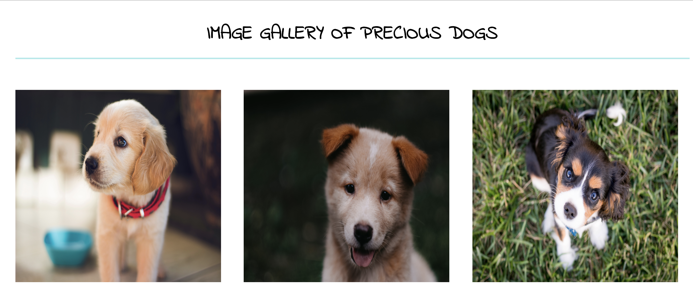

# Photo-Blog
This project is a simple photo blog page that displays various images of dogs. The properties of the image were assigned using a CSS program.
The font used for the text in the page has been imported from Google Fonts and is referenced in the HTML file using the link tag.

The image below represents a part of the webpage demonstrating relevant details of the page. 

